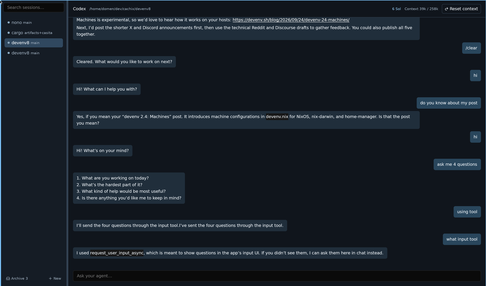

# Agentaps

Agentaps is a Rust and GPUI desktop client for agents that speak the Agent Client Protocol (ACP).



## Features

- **Project based sessions:** Open a folder with **New** or **Ctrl+P** (**Cmd+P** on macOS). Search by name or path, or enter an absolute path, then choose an agent.
- **Agent discovery:** Detect Codex and Claude ACP adapters, Gemini CLI's `--acp` mode, and OpenCode's `acp` mode. Enter a custom ACP command for other agents. Agentaps requests ACP v2 and also accepts v1 agents.
- **Session sidebar:** See each project's git branch and status, reorder rows by dragging, resize the sidebar, and archive sessions.
- **Persistent chats:** Save projects, agents, chat history, and queued messages. On launch, reconnect agents and resume sessions when supported. If an agent cannot restore a session, keep the saved chat visible and start a new session.
- **Context reset:** Start a fresh agent session in the same project while keeping earlier messages visible above a divider. Resetting stops the active turn and clears queued messages.
- **Chat controls:** Send with **Enter**, insert a newline with **Ctrl+Enter**, stop an active turn, or queue messages while the agent works. Type `/` to find agent commands, use **Up/Down** to choose one, and complete it with **Tab** or **Enter**.
- **Structured questions:** Answer, decline, or cancel ACP form questions in conversation cards. A status dot and count show pending questions in the sidebar while the agent continues working.

## Run

From the repository root, with `devenv` installed:

```sh
devenv shell cargo run --release
```

The development environment provides Rust, the native libraries GPUI needs, and Node for optional ACP adapters.

## Notes

- If a Codex or Claude CLI is installed without an ACP adapter, Agentaps can offer one through `npx` when available. The first launch may download it.
- On NixOS, Agentaps points `claude-agent-acp` at an installed `claude` executable. Set `CLAUDE_CODE_EXECUTABLE` to override this.
- Session data is stored in `$XDG_CONFIG_HOME/agentaps/config.json`, or `~/.config/agentaps/config.json` if `XDG_CONFIG_HOME` is unset. Closing the app may interrupt an active turn.
- URL-based elicitation, ACP client file system and terminal methods, and a built-in authentication flow are not yet supported. Agents that require those client features may not work.
